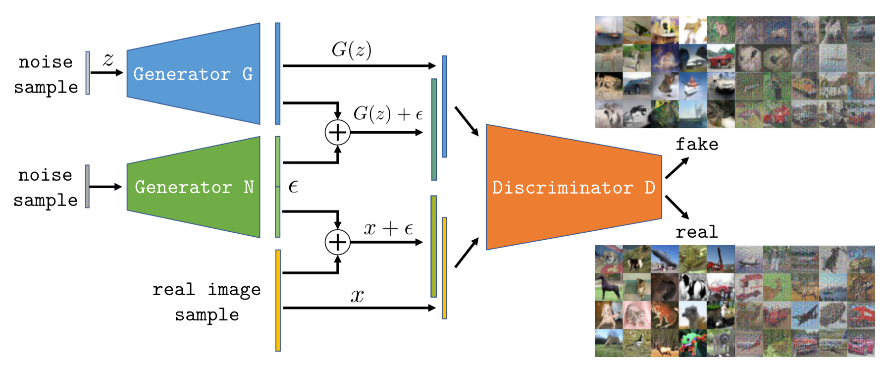
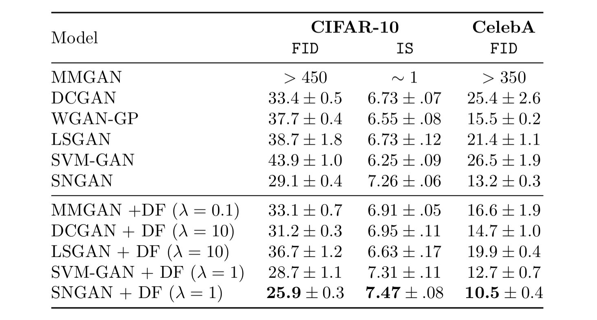

  <b style="font-size: 24px">Paper:</b> 
  <a href="https://arxiv.org/abs/1906.04612" style="font-size: 24px; text-decoration: none">[Arxiv]</a>

  <b style="font-size: 24px">Code:</b> 
  <a href="https://github.com/sjenni/dfgan" style="font-size: 24px; text-decoration: none">[GitHub]</a>

*Our DFGAN model. To improve the stability of GAN training, we propose to add noise samples to half of the images in each mini-batch fed to the discriminator. This leads to more stable training by increasing the support of both the data and generator distributions. To challenge the discriminator we propose to learn the additive noise via a noise generator N.*

___

# Abstract
We present a novel method and analysis to train generative adversarial networks (GAN) in a stable manner. As shown in recent analysis, training is often undermined by the probability distribution of the data being zero on neighborhoods of the data space. We notice that the distributions of real and generated data should match even when they undergo the same filtering. Therefore, to address the limited support problem we propose to train GANs by using different filtered versions of the real and generated data distributions. In this way, filtering does not prevent the exact matching of the data distribution, while helping training by extending the support of both distributions. As filtering we consider adding samples from an arbitrary distribution to the data, which corresponds to a convolution of the data distribution with the arbitrary one. We also propose to learn the generation of these samples so as to challenge the discriminator in the adversarial training. We show that our approach results in a stable and well-behaved training of even the original minimax GAN formulation. Moreover, our technique can be incorporated in most modern GAN formulations and leads to a consistent improvement on several common datasets. 

___

# Results

*We apply our proposed GAN training to various previous GAN models trained on CIFAR-10 and CelebA. The same network 
architectures and hyperparameters as in the original works are used. We observe that our method increases performance
 in most cases even with the suggested hyperparameter settings. Note that our method also allows successful training
  with the original minimax MMGAN loss as opposed to the commonly used heuristic (e.g., in DCGAN).*
